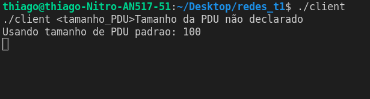
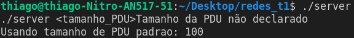
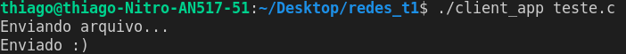
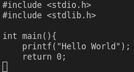
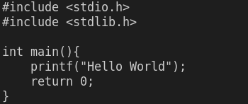

# Entrega 01 Fundamento de Redes de Computadores

| Aluno   |      Matrícula    
|----------|:-------------:
| Thiago Luiz de Souza Gomes |  180028324 
| Wagner Martins da Cunha |    180029177 


## Sobre o Projeto


<br>

## Como rodar

### Dependências
```
gcc 
```

### Primeira etapa

Crie um arquivo como teste.c

Exemplo:
```c
#include <stdio.h>
#include <stdlib.h>

int main(){
    printf("Hello World");
    return 0;
}
```

### Segunda etapa
Abra um terminal e dentro da pasta do projeto execute os seguintes comandos
```
gcc utils.c link_layer_client.c -o client -lrt
./client <int tamanho_PDU>
```
Resultado:



**Obs**: Nesta exemplo não foi colocado um tamanho especifíco para o PDU então setou 100 como padrão


### Terceira etapa
Abra um terminal e dentro da pasta do projeto execute os seguintes comandos
```
gcc utils.c link_layer_server.c -o server -lrt
./server <int tamanho_PDU>
```
Resultado:



**Obs**: Nesta exemplo não foi colocado um tamanho especifíco para o PDU então setou 100 como padrão


### Quarta etapa
Abra um terminal e dentro da pasta do projeto execute os seguintes comandos
```
gcc utils.c client_app.c -o client_app -lrt
./client_app teste.c
```
Resultado:



**Observe o terminal da terceira etapa:**
<br>


## Quinta etapa
Abra um terminal e dentro da pasta do projeto execute os seguintes comandos
```
gcc utils.c server_app.c -o server_app -lrt
./server_app
```
Resultado:

